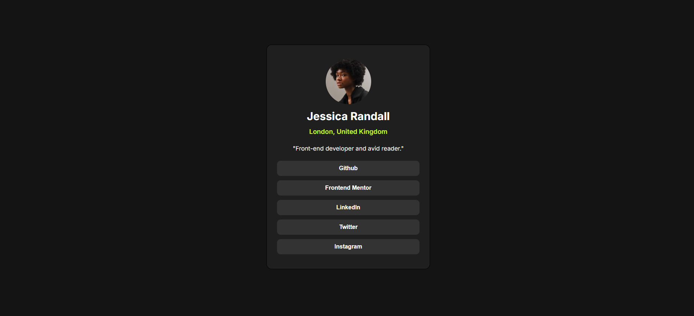

# Frontend Mentor - Social links profile solution

This is a solution to the [Social links profile challenge on Frontend Mentor](https://www.frontendmentor.io/challenges/social-links-profile-UG32l9m6dQ). Frontend Mentor challenges help you improve your coding skills by building realistic projects. 

## Table of contents

- [Overview](#overview)
  - [The challenge](#the-challenge)
  - [Screenshot](#screenshot)
  - [Links](#links)
- [My process](#my-process)
  - [Built with](#built-with)
  - [Useful resources](#useful-resources)
- [Author](#author)

# Overview

### The challenge
Users should be able to:

- See hover and focus states for all interactive elements on the page

### Screenshot

### Links
- Solution URL : [https://github.com/jaysonalfie/Social-links-profile.git]
- Live Site URL: [https://social-links-profile-bay-omega.vercel.app/]

## My process
I also used HTML together with CSS to make the layout and also Javascript to make the button clickable and lead to the sites. Vanilla css was used for styling of the component.

## Built with

- Semantic HTML5 markup
- CSS custom properties
- Javascript

## Resources
- [MDN Docs](https://developer.mozilla.org/en-US/)

## Author
- Github - [Jaysonalfie](https://github.com/jaysonalfie)
- Frontend mentor - [Jaysonalfie](https://www.frontendmentor.io/profile/jaysonalfie)